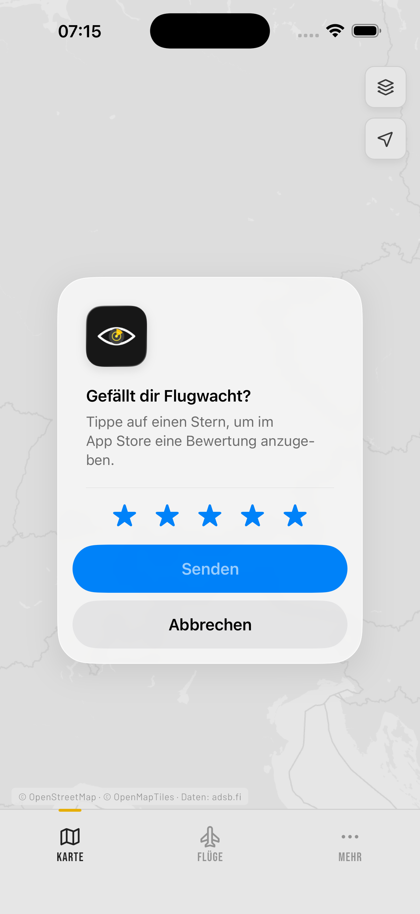

# review_etiquette

[](https://pub.dev/packages/review_etiquette)
[](https://pub.dev/packages/review_etiquette/score)
[](https://pub.dev/publishers/boundfoxstudios.com)
[](https://github.com/BoundfoxStudios/review_etiquette/actions/workflows/ci.yml)

Ask for an in-app review when your app has just delivered value, not when it
starts.

Apple and Google both describe how a review request should behave, and both
descriptions say the same thing: ask rarely, ask after a moment of success, and
never wire the system prompt to a button. Most timing packages ignore that and
count app launches instead. This one codifies the etiquette.

The trigger is yours to choose: an export finished, a workout was logged, a
level was beaten. You call one method at that moment, and the package decides
whether asking right now is allowed.



*What the user sees on iOS: the system prompt, triggered after a success event.
The package decides the moment; the sheet itself belongs to the platform.*

## Requirements

| Platform | Minimum |
| --- | --- |
| iOS | 16.0 |
| Android | API 24 |

**iOS 16.0 is above Flutter's own floor of 15.0.** That is deliberate:
`AppStore.requestReview(in:)` starts at iOS 16, and this package does not carry
availability guards or fall back to the deprecated `SKStoreReviewController`.
An app on Flutter's default target has to raise its own deployment target
before it can depend on this package. Set `IPHONEOS_DEPLOYMENT_TARGET` to
`16.0` in `ios/Runner.xcodeproj`, and if you still use CocoaPods, set
`platform :ios, '16.0'` in `ios/Podfile`.

If you raise the target and then build straight from Xcode, you may still see
`The package product 'review-etiquette' requires minimum platform version 16.0
for the iOS platform, but this target supports 15.0`. Flutter regenerates its
plugin Swift package from its own floor on every `flutter pub get` and only
raises it again during an iOS build, so run `flutter build ios --config-only`
once afterwards. Building or running through the `flutter` command does this
for you.

On Android nothing special is needed, but the Play In-App Review library lives
in Google's Maven repository rather than on Maven Central. Flutter's own
template already includes `google()`; if your `settings.gradle.kts` was
hand-written, make sure it is there.

## Install

```yaml
dependencies:
  review_etiquette: ^1.0.0
```

## Usage

Create one instance, hand it your app version, and keep it around. The package
never reads the version itself, which keeps a dependency and a platform channel
out of the picture.

```dart
import 'package:review_etiquette/review_etiquette.dart';

final etiquette = ReviewEtiquette(appVersion: '1.4.2');
```

Then call it at the moment your app delivered something:

```dart
Future<void> onExportFinished() async {
  await saveTheFile();

  final outcome = await etiquette.requestReview();
  // Ignore the outcome unless you want it for analytics.
}
```

`requestReview()` never throws. Every failure, on either platform, comes back
as `ReviewRequestOutcome.unavailable`, because a review request must never
disturb the flow it is attached to.

| Outcome | Meaning |
| --- | --- |
| `requested` | The system prompt was triggered |
| `skippedTooSoon` | The cooldown has not elapsed yet |
| `skippedSameVersion` | This app version already asked |
| `unavailable` | The platform could not ask, for example with no Play Store installed |

### The one thing to internalise

`requested` means **we asked**, not **the user saw a prompt**.

Neither platform reports back. Apple shows the prompt at most three times per
365 days and shows nothing at all in TestFlight builds; Google states plainly
that the API "does not indicate whether the user reviewed or not, or even
whether the review dialog was shown". Any analytics you build on top of this
counts requests, never impressions, and any UI that says "thanks for rating"
after a `requested` outcome is lying to your users.

### A button that says "rate this app"

Both platforms forbid attaching the system prompt to a tap. The sanctioned
path is the store listing, and that is a separate call:

```dart
TextButton(
  onPressed: () => etiquette.openStoreListing(appStoreId: '123456789'),
  child: const Text('Rate this app'),
)
```

Both entry points sit on the same instance, so the object you register in your
dependency injection container covers the whole surface.

Where the button sits far away from that object, there is a static variant that
does exactly the same thing. Opening the store page needs neither an app version
nor a cooldown, so there is nothing to construct:

```dart
TextButton(
  onPressed: () => ReviewEtiquette.showStoreListing(appStoreId: '123456789'),
  child: const Text('Rate this app'),
)
```

The name differs only because Dart forbids a static and an instance member
sharing one.

`appStoreId` is only used on iOS; Android derives the listing from the package
name. It is optional so that an Android-only app does not have to invent a
value, but leaving it out on iOS throws `ReviewEtiquetteException` rather than
doing nothing.

Unlike `requestReview()`, this one **does** throw when the store cannot be
opened. A button that silently does nothing is worse than an error you can
handle.

## How the timing works

Two conditions, both of which must hold:

1. The cooldown has elapsed since the last request.
2. The current app version has not asked yet.

The default cooldown is 120 days. Apple allows three prompts per 365 days,
which works out to roughly 122 days apart, so the default spreads the yearly
allowance over the year instead of burning it in a week. It sits far above
Apple's own guidance of "at least a week or two between requests". Change it if
your release cadence calls for something else:

```dart
ReviewEtiquette(
  appVersion: '1.4.2',
  cooldown: const Duration(days: 60),
);
```

The version condition exists because a triggering event can stay visible for
hours. Without it, every app start inside that window would ask again and burn
the yearly allowance on a single event.

Pass the user-visible version, not a build number that changes on every CI run,
or the version condition never holds.

State is a timestamp and a version string in `shared_preferences`. The native
side stores nothing, which is why this package needs no privacy manifest entry
of its own. `shared_preferences` declares its own `NSUserDefaults` usage.

## Trying it out

The prompt is deliberately hard to observe, so verify it like this:

* **iOS:** a development build shows the sheet every time. A TestFlight build
  never shows it. Do not conclude the package is broken from a TestFlight run.
* **Android:** use the internal test track, where the quota is not enforced.
  Internal app sharing shows the card but disables submitting.

While testing, the package's own cooldown will block your second attempt for
120 days. Bypass both conditions in debug builds:

```dart
ReviewEtiquette(
  appVersion: kDebugMode ? 'debug-${DateTime.now()}' : packageInfo.version,
  cooldown: kDebugMode ? Duration.zero : const Duration(days: 120),
);
```

## What this package will not do

* Count app launches or success events for you. Only your app knows when an
  event is worth counting.
* Show a "do you like the app?" dialog first. Google forbids it and Apple
  advises against it.
* Attach the system prompt to a button.
* Support iOS below 16 or Android below API 24.

## License

MIT. See [LICENSE](LICENSE).

The Android side depends on the Play In-App Review library, which is covered by
the Play Core Software Development Kit Terms of Service. Data safety
declarations for the review your users submit are the host app's
responsibility.
